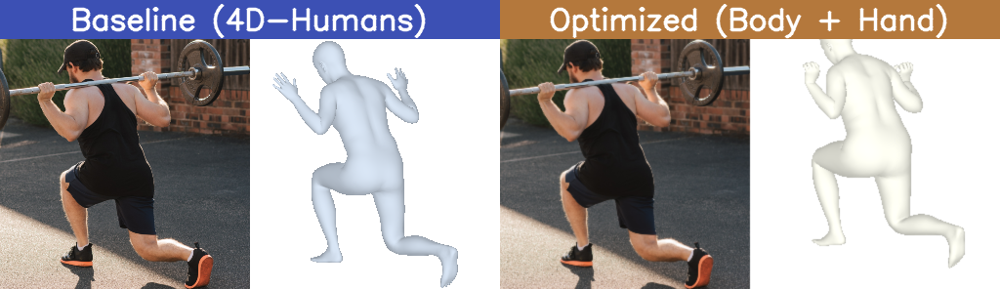
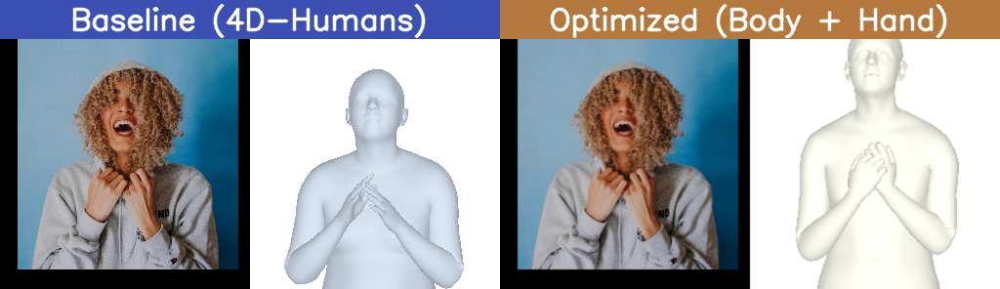

# Body + Hand Mesh Recovery (HMR2 + HaMeR + SMPL-X)

> 单图人体+手部三维重建 · 面向具身智能与动捕数据生成  
> Single-image body & hand mesh reconstruction for embodied AI and motion capture data generation.

本仓库提供一套自包含的 **单目 RGB 人体+手部联合三维重建**  pipeline：从单张图片中同时估计身体姿态（HMR2 / 4D-Humans）与手部姿态（HaMeR），并融合为统一的 **SMPL-X** 参数化人体网格。可用于：

- **具身智能（Embodied AI）**：从视频/图像生成带手部位姿的 3D 人体数据，供机器人模仿学习、导航交互使用；  
- **动作捕捉与数字人**：低成本、免穿戴的动捕数据（MoCap）采集方案，输出带手指关节的完整 SMPL-X 序列；  
- **数据集构建**：批量将 RGB 图像/视频转换为带手部细节的参数化人体 mesh，快速构建大规模 3D 人体数据集。

A self-contained pipeline that combines **4D-Humans (HMR2)** for body pose, **HaMeR** for hand pose, and **SMPL-X** for unified body + hand mesh output from a single RGB image. Ideal for embodied AI, motion capture (MoCap) data generation, and large-scale digital human dataset construction.

---

**Keywords**: SMPL-X, HMR2, HaMeR, human mesh recovery, hand reconstruction, motion capture, MoCap, embodied AI, digital human, 3D human pose estimation, MANO, parametric body model.

## Results

### Baseline (4D-Humans) vs. Optimized (Body + Hand)

The following comparisons show the improvement when fusing **HMR2** body pose with **HaMeR** hand pose into a unified **SMPL-X** mesh. The left column is the baseline 4D-Humans output; the right column is our optimized body+hand reconstruction.

| Barbell (Hands Gripping) | Hoodie Strings (Hands Near Face) |
|:---:|:---:|
|  |  |

**Observation**: The baseline produces blob-like hands with no finger articulation. After injecting HaMeR hand predictions, fingers are clearly separated and naturally posed—critical for embodied AI datasets and motion capture applications where hand-grasp semantics matter.

## Output

For every detected person, the script writes:

- `person_{i}_smplx.obj` – SMPL-X mesh with HMR2 body + HaMeR hands
- `person_{i}_rendered.png` – rendered overlay on the input image

## Setup

### 1. Install Python dependencies

```bash
pip install -r requirements.txt
```

> **Note:** `detectron2` and `mmpose` often need platform-specific builds. If the pip install above fails for those packages, follow the official install guides:
> - [Detectron2](https://github.com/facebookresearch/detectron2/blob/main/INSTALL.md)
> - [MMPose](https://mmpose.readthedocs.io/en/latest/installation.html)

### 2. Download model checkpoints

Run the upstream fetch scripts (or manually download) so the following checkpoints exist:

```
_DATA/
├── hmr2/
│   └── logs/train/multiruns/hmr2/0/checkpoints/epoch=35-step=1000000.ckpt
├── hamer/
│   └── logs/train/multiruns/hamer/0/checkpoints/epoch=35-step=1000000.ckpt
└── vitpose_ckpts/
    └── vitpose+_huge/
        └── wholebody.pth
```

The default `CACHE_DIR_HAMER` is `./_DATA` (relative to this repo root). You can override it:

```bash
export HAMER_CACHE_DIR=/your/custom/cache/path
```

### 3. Download SMPL-X

Download the **SMPL-X neutral model** (`SMPLX_NEUTRAL_py3.pkl`) from the [SMPL-X website](https://smpl-x.is.tue.mpg.de/) and place it somewhere accessible.

## Usage

```bash
export SMPLX_PATH=/path/to/SMPLX_NEUTRAL_py3.pkl
python demo.py --img /path/to/image.jpg --out output
```

Optional arguments:

- `--device cuda` (default) or `--device cpu`
- `--out` output directory (default: `output`)

## Rendering note

Rendering uses OSMesa for headless/off-screen rendering. If you encounter shader errors, make sure the OSMesa shared library is available in `LD_LIBRARY_PATH`:

```bash
export LD_LIBRARY_PATH=/path/to/osmesa/lib:$LD_LIBRARY_PATH
```

On the original setup this was satisfied by the `osmesa_tmp` directory from the 4D-Humans repo.

## Credits

- [4D-Humans / HMR2](https://github.com/shubham-goel/4D-Humans)
- [HaMeR](https://github.com/geopavlakos/hamer)
- [SMPL-X](https://smpl-x.is.tue.mpg.de/)
